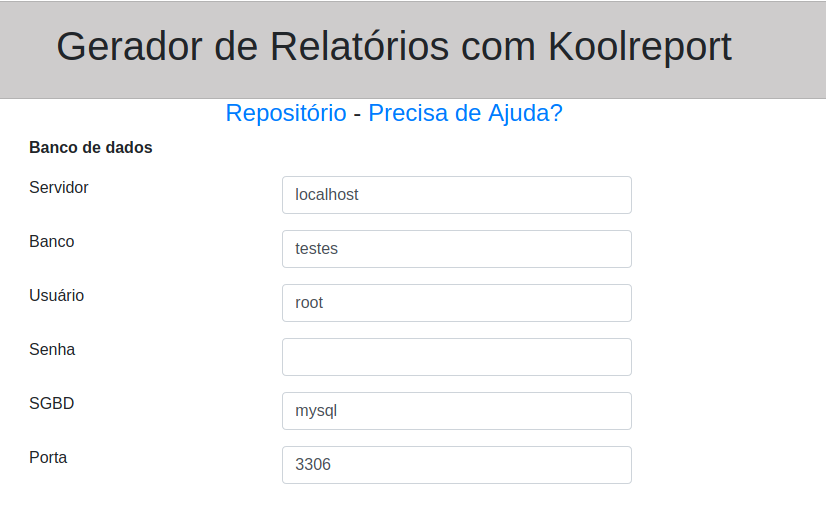
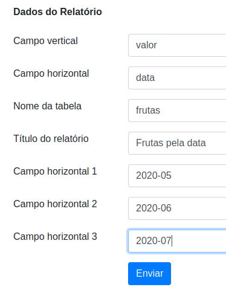
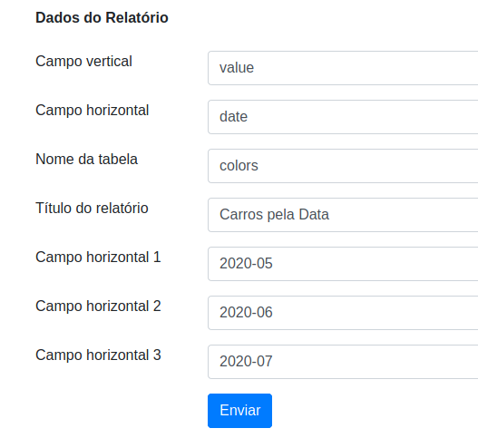

# Gerando Relatórios sem Código

Imagina abrir um formulário, digitar os dados do banco e do relatório então clicar em enviar e o relatório ser aberto na sua frente! Ontem isso era um sonho meu e hoje se realizou. Confira, compartilhe, faça um fork e otimize.

Este simples e pequeno gerador de relatórios que usa a ferramenta em PHP Koolreport já está funcional, mas basicamente ele cria o relatório de exemplo abaixo

https://github.com/ribafs/reports/tree/main/src/exemplos/CarsByDate

Como é em PHP e é simples, você pode melhorá-lo à vontada. Usa a licença MIT, que é uma das mais generosas.

## Requisitos

- PHP 5.6
- Composer

## Crie uma pasta no seu diretório web

mkdir /var/www/html/relatorios

Adapte para seu servidor web, onde a pasta pode ser diferente.

cd /var/www/html/relatorios

Faça o download/clone deste repositório na pasta acima e descompacte

## Instalação

composer install

## Agora abra pelo navegador

http://localhost/relatorios

## Crie o banco de dados

Veja pela frase abaixo que este gerados simplifica muito mas para criar um relatório, qualquer que seja ele, você precisa entender os dados da tabela e como agrupá-los em um relatório.

Atente para que a tabela tenha um campo com valores e use dois campos da tabela, um com valores que ficará na vertical do gráfico de colunas e outro com a descrição que ficará na horizontal e a consulta agrupará por este. Para testes pode usar um dos scripts sql do repositório em:

https://github.com/ribafs/reports/tree/main/src/exemplos (um é para o MySQL (cars_my.sql) e o outro para o PostgreSQL (cars_pg.sql))

Preencha o formulário e apenas clique em enviar.

Parece ser um projeto que tem futuro, pois facilita muito a vida de quem deseja criar relatórios mas ainda precisa melhorar bastante para ser ainda mais útil.

## Alternativa ao gerador

Caso domine PHP e queira uma alternativa de criação de relatórios via código com mais flexibilidade:

https://github.com/ribafs/reports

## Veja ascapturas do form do

### Sobre os dados do relatórios

## Feedback

Caso chegue a experimentar ou tentar, eu agradeceria receber um feedback. Caso encontre algum erro ou queira enviar alguma sugestão, por favor use o issue para isso:

[Me envie um feeedback](https://github.com/ribafs/report-generator/issues)

## Licença

MIT

